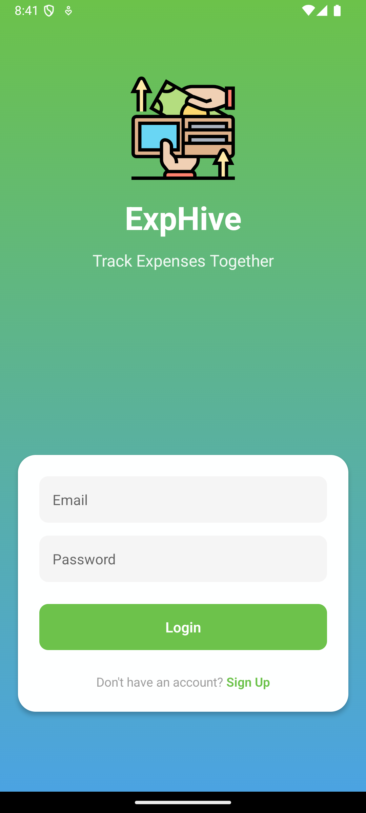
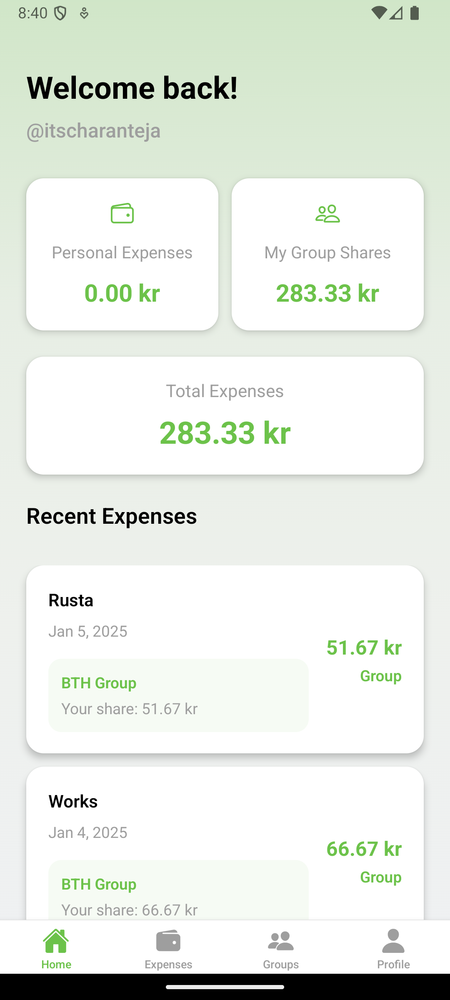
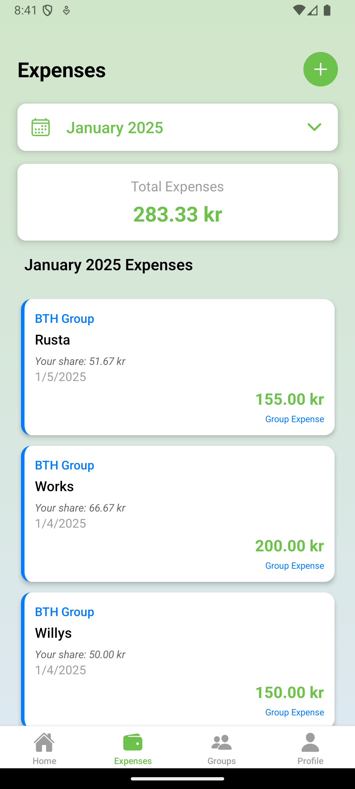

# ExpenseHive 📱💰

> A modern expense tracking and group management app built with React Native.
> ExpenseHive is designed to simplify the way you manage your finances and group expenses. Whether you're splitting bills with friends, tracking your personal expenses, or managing a group's finances, ExpenseHive provides a seamless and intuitive experience. With real-time updates, secure data handling, and a user-friendly interface, keeping track of your expenses has never been easier.

## ✨ Features

### 💰 Expense Management

- Real-time expense tracking
- Split bills automatically
- Detailed transaction history

### 👥 Group Features

- Create & manage expense groups
- Add members easily
- Share expenses within groups
- Real-time balance updates

### 🔐 Security

- Secure authentication
- Data encryption
- Private user data protection

## 🛠️ Tech Stack

- **Frontend**: React Native + Expo
- **Backend**: Firebase
- **Authentication**: Firebase Auth
- **Database**: Firestore
- **Storage**: Firebase Storage + Async Storage

## 📱 Screenshots

<table>
  <tr>
    <td></td>
    <td></td>
    <td></td>
  </tr>
</table>

## 🚀 Getting Started

### Prerequisites

- Node.js (>= 14.x)
- npm
- Expo CLI

### 🚀 Installation

1. **Download the ZIP file**: Get the latest version of ExpenseHive.
2. **Extract the folder**: Unzip the downloaded file and open the folder.
3. **Install dependencies**: Run the following command to install all required dependencies:
   ```sh
   npm install
   ```
4. **Start the app**: Launch the app with Expo by running:
   ```sh
   npx expo start -c
   ```

#### 📱 Building for Android

**Debug Release**:

1. Prebuild the project:
   ```sh
   npx expo prebuild
   ```
2. Navigate to the Android directory:
   ```sh
   cd android/
   ```
3. Clean the project:
   ```sh
   ./gradlew clean
   ```
4. Assemble the debug build:
   ```sh
   ./gradlew assembleDebug
   ```

**Final Release**:

1. Prebuild the project:
   ```sh
   npx expo prebuild
   ```
2. Navigate to the Android directory:
   ```sh
   cd android/
   ```
3. Clean the project:
   ```sh
   ./gradlew clean
   ```
4. Assemble the release build:
   ```sh
   ./gradlew assembleRelease
   ```
